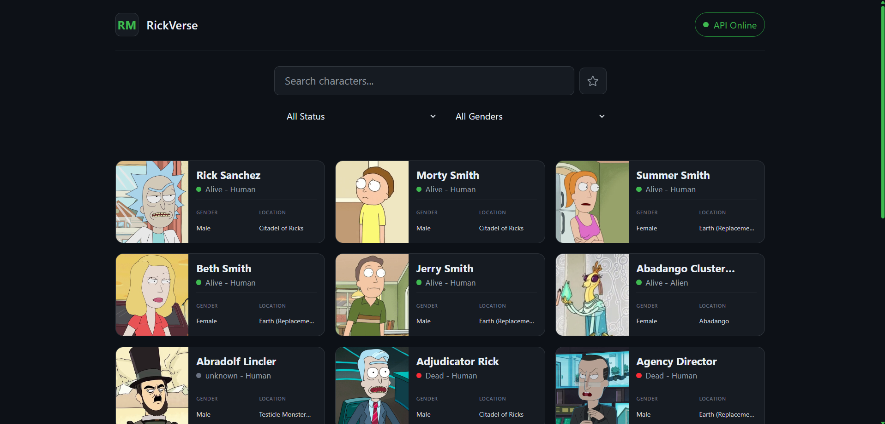
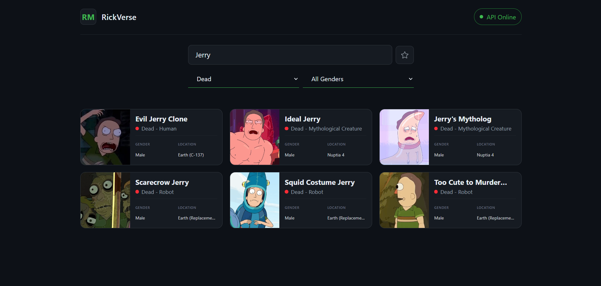
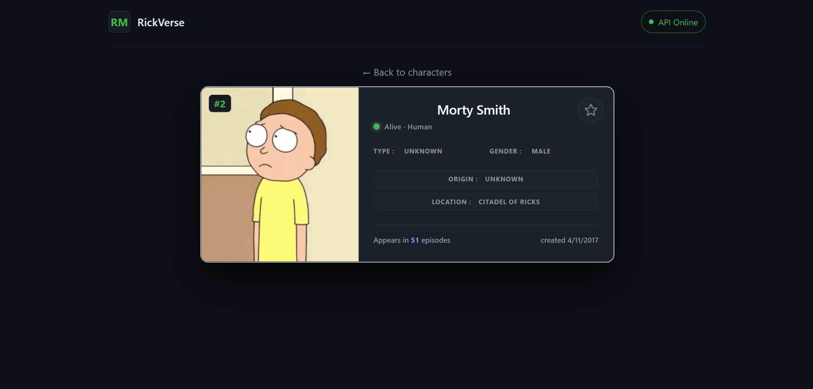
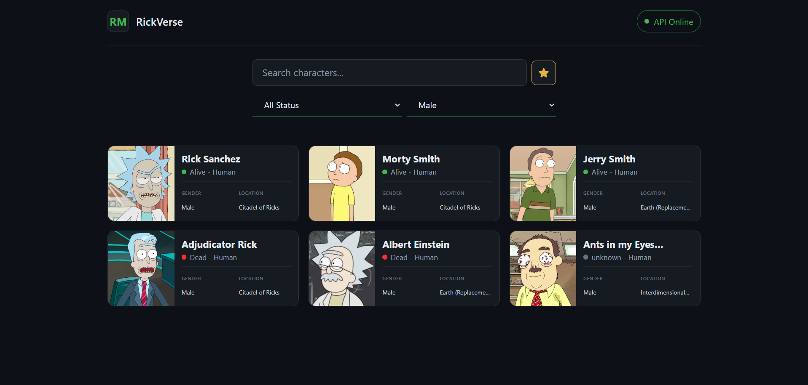

# RickVerse


Aplicación web para explorar personajes del universo de **Rick and Morty**,
construida con **React**, **TypeScript** y **Tailwind CSS**.

RickVerse consume **The Rick and Morty API** para permitir la búsqueda y
exploración de personajes, aplicar filtros por estado y género, consultar
información detallada y administrar una lista de favoritos persistente
en el navegador.

> Proyecto de portafolio enfocado en React y TypeScript, consumo de APIs REST, manejo de estado, persistencia local.

---

## Contenido

- [Sobre el proyecto](#sobre-el-proyecto)
- [Capturas de pantalla](#capturas-de-pantalla)
- [Funcionalidades](#funcionalidades)
- [Stack](#stack)
- [Arquitectura](#arquitectura)
- [API](#api)
- [Cómo ejecutar el proyecto](#cómo-ejecutar-el-proyecto)
- [Autor](#autor)

---

## Sobre el proyecto

RickVerse es una aplicación web que permite explorar personajes del
universo de Rick and Morty utilizando datos obtenidos desde una API REST.

La aplicación permite:

- Explorar el catálogo de personajes.
- Buscar personajes por nombre mediante búsqueda con debounce.
- Filtrar personajes por estado y género.
- Consultar información detallada de cada personaje.
- Marcar y desmarcar personajes como favoritos.
- Mantener los favoritos entre sesiones mediante persistencia local.
- Combinar la vista de favoritos con los filtros de búsqueda, estado y género.
- Mostrar skeletons durante la carga de datos para mantener una
  experiencia visual fluida.
- Comunicar estados de error y resultados vacíos durante la interacción
  con la API.

El objetivo del proyecto es aplicar fundamentos modernos de desarrollo
frontend con **React y TypeScript**, manteniendo separadas la interfaz,
la lógica de estado y la comunicación con la API mediante componentes
reutilizables, custom hooks y una capa dedicada de acceso a datos.

---

## Capturas de pantalla

### Exploración de personajes

La página principal presenta los personajes en un grid responsive e
incluye búsqueda por nombre y filtros por estado y género.

<p align="center">
  
</p>

### Búsqueda y filtros

Los personajes pueden filtrarse por nombre, estado y género. La búsqueda
utiliza debounce para evitar solicitudes innecesarias mientras el usuario
escribe.

<p align="center">
  
</p>

### Detalle del personaje

Cada personaje cuenta con una vista de detalle que muestra su información
principal y permite agregarlo o eliminarlo de favoritos mediante el botón
de estrella.

<p align="center">
  
</p>

### Favoritos

Los personajes marcados como favoritos se almacenan localmente y pueden
consultarse utilizando conjuntamente los filtros de búsqueda, estado y
género.

<p align="center">
  
</p>

---

## Funcionalidades

### Exploración de personajes

- Listado de personajes obtenidos desde The Rick and Morty API.
- Visualización en un grid responsive.
- Navegación desde cada personaje hacia su vista de detalle.
- Manejo de estados de carga mediante skeletons.
- Manejo de errores y resultados sin coincidencias.

### Búsqueda y filtros

- Búsqueda de personajes por nombre.
- Debounce de 500 ms para evitar solicitudes innecesarias mientras el
  usuario escribe.
- Filtrado por estado del personaje.
- Filtrado por género.
- Combinación de búsqueda, estado y género.
- Actualización dinámica de los resultados.

### Detalle del personaje

- Vista individual para cada personaje.
- Visualización de información detallada del personaje.
- Navegación mediante rutas dinámicas.
- Botón de estrella para agregar o eliminar el personaje de favoritos.
- Feedback visual mediante notificaciones al modificar favoritos.

### Favoritos

- Marcado y desmarcado de personajes como favoritos.
- Persistencia de favoritos en `localStorage`.
- Recuperación automática de los favoritos al volver a cargar la
  aplicación.
- Vista de todos los personajes guardados como favoritos.
- Combinación de favoritos con los filtros existentes.

  ---

## Stack

### Frontend

- **React 19**
- **TypeScript 6**
- **Tailwind CSS 4**
- **React Router DOM 7**
- **Sonner**

### APIs y persistencia

- **Fetch API**
- **The Rick and Morty API**
- **Web Storage API (`localStorage`)**

### Herramientas de desarrollo

- **Vite 8**
- **ESLint**
- **npm**

  ---

  ## Arquitectura

```text
src/
  api/
    rickAndMorty.ts          → Comunicación con The Rick and Morty API

  components/                → Componentes reutilizables de interfaz

  hooks/
    useCharacters.ts         → Listado, búsqueda, filtros y vista de favoritos
    useCharacter.ts          → Carga del detalle de un personaje
    useFavorites.ts          → Estado y persistencia de favoritos

  pages/                     → Vistas principales de la aplicación

  types/
    character.ts             → Tipos del dominio

  App.tsx                    → Configuración principal y navegación
```

RickVerse mantiene separadas las responsabilidades de presentación,
manejo de estado y comunicación con servicios externos.

Las páginas y componentes se encargan de representar la interfaz,
mientras que los **custom hooks** encapsulan la lógica relacionada con
la carga de datos, búsqueda, filtros y favoritos. La comunicación con
The Rick and Morty API se mantiene aislada en una capa dedicada de API.

El flujo principal de datos sigue una estructura simple:

```text
Page / Component
       ↓
   Custom Hook
       ↓
    API Layer
       ↓
The Rick and Morty API
```

La persistencia de favoritos se mantiene encapsulada en `useFavorites`,
que administra los identificadores almacenados en el navegador:

```text
Component
    ↓
useFavorites
    ↓
localStorage
```

Esta separación permite mantener la lógica de obtención de datos y estado
fuera de los componentes de presentación, evitando que la interfaz dependa
directamente de los detalles de comunicación con la API o de persistencia.

---

## API

Los datos utilizados por RickVerse son proporcionados por
**The Rick and Morty API**.

[Documentación oficial de The Rick and Morty API](https://rickandmortyapi.com/documentation)

---

## Cómo ejecutar el proyecto

### Requisitos

- Node.js
- npm
- Git

### Instalación

1. Clona el repositorio:

```bash
git clone https://github.com/josecarlosonate/RickVerse.git
cd RickVerse
```

2. Instala las dependencias:

```bash
npm install
```

3. Inicia el servidor de desarrollo:

```bash
npm run dev
```

4. Abre en el navegador la URL indicada por Vite, normalmente:

```text
http://localhost:5173
```

---

## Autor

**Jose Carlos Oñate Rodríguez**

Proyecto de portafolio --- React / TypeScript / Tailwind CSS
